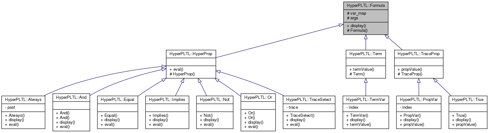

**Build instructions**

- Debug build [ *default* ]

  ```bash
  mkdir build
  cd build
  cmake ..
  make
  ```

  

- Release build

  ```bash
  mkdir build
  cd build
  cmake .. -DCMAKE_BUILD_TYPE=Release
  make
  ```


**Inheritance diagram**

