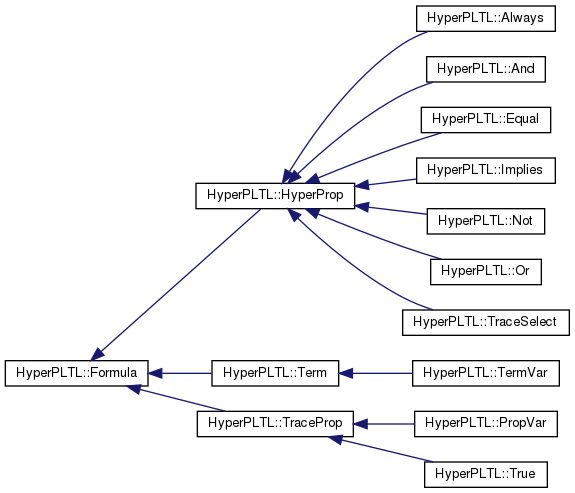

**Build instructions**

* Installing dependencies

  ```bash
  sudo ./setup.sh
  ```

- Debug build [ *default* ]

  ```bash
  mkdir build
  cd build
  cmake ..
  make
  ```

- Release build

  ```bash
  mkdir build
  cd build
  cmake .. -DCMAKE_BUILD_TYPE=Release
  make
  ```

- Running tests in build directory

  ```bash
  make test
  ```
- Running tests individually in build directory
  ```bash
  ./bin/testlibprop --gtest_filter="[TEST_NAME]"
  ```
  e.g. <code>./bin/testlibprop --gtest_filter="PropertyLibTest.ValidTraceNotOperator"</code>

**Inheritance diagram**



[(complete class diagram)](https://github.com/tgourav/fuzztest/blob/master/libprop/doc/class_hyper_p_l_t_l_1_1_formula__inherit__graph.png)
